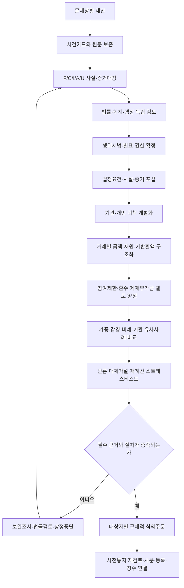

# 04. (안건수립) 안건 수립 및 구체화

> 목적: 구조화되지 않은 문제상황을 법률·회계·전문기관 행정의 검토 결과와 연결하여, 사실에서 주문까지 추적 가능하고 양정을 재계산할 수 있는 안건파일로 작성한다.
>
> 샘플 격리 원칙: 1~4호 안건은 문서 구조·작성 깊이·표현 방식만 참고한다. 샘플의 사건사실, 금액, 법률판단, 감경·가중, 처분기간 또는 결론을 다른 사건의 증거·선례·양정근거로 사용하거나 서로 섞지 않는다.

## 0. 사용 순서와 선행 입력

다음 순서로 수행한다.

1. `03. 페르소나 집단 토의`로 원문 사안, 사실상태, 증거, 대립가설, 법률·회계·행정 쟁점을 구조화한다.
2. `01. 기본 법령정보.md`를 출발점으로 삼되, 위반행위일과 처분예정일에 적용되는 공식 법령·별표·부칙·행정규칙 원문을 다시 확인한다.
3. `02. 전문기관 대응 점검 체크리스트`로 처분권자, 전문기관의 대행범위, 조사·평가단·사전통지·재검토·송달·징수 절차를 검증한다.
4. 이 문서로 사실·법률·금액·양정·절차를 하나의 안건으로 통합한다.

선행 문서를 읽지 못했으면 읽은 것처럼 인용하지 않는다. 사건자료가 부족해도 먼저 사건카드와 미확인사항을 구조화하고, 결론을 바꾸는 질문만 최대 5개까지 제시한다. 조건부 분석이 가능하면 전제와 유보를 표시하고 진행한다.

## 1. 샘플 문서군 분석

### 1.1 문서군별 공통 구조와 차이

| 문서군 | 샘플에서 관찰된 공통 구조 | 반복 항목 | 작성 방식·서술 깊이 | 필요한 정보 | 구조 해석 |
|---|---|---|---|---|---|
| 연구윤리 제재형 | 과제현황 → 심의주문 → 표절·부당저자 등 사건개요 → 조사·검증 경과 → 법령·별표 → 대상자별 귀책 → 참여제한·부가금·환수 판단 → 참고자료 | 논문·성과 식별, 기여 또는 관여, 철회·검증 결과, 기관·개인 분리, 조사협조, 가중·감경 | 본문은 결론 중심, 별첨은 논문·계획서·검증자료와 법령 원문 중심. 행위별·대상자별 판단 깊이가 중요 | 성과 원문, 저자 기여자료, 버전·출처 비교, 검증보고서, 소명, 과제 참여관계, 관련 집행액 | 연구부정 확정과 제재대상·양정은 별도 단계다. 검증결과를 그대로 처분결론으로 복사하지 않는다. |
| 연구개발비 사용·재검토형 | 과제현황 → 주문 → 거래·인건비 등 문제금액 → 실태조사·특별평가 → 거래별 명세 → 법적 근거 → 사업부서·평가단·재검토 의견 → 최종안 | 거래일·금액·지연일수, 자금흐름, 정부지원 비율, 환수 산식, 조사협조, 회복, 원처분·재검토 비교 | 거래단위 표가 핵심이며, 최초안·평가단안·재검토안을 구분해 의사결정 변화를 보여준다. | 원장·계좌·급여·전표·증빙, 모집단, 정부지원 비율, 기반환액, 확인서·소명서, 각 심의결과 | 정산 불인정, 용도·기준 위반, 환수, 제재부가금은 같은 금액처럼 보여도 법적 정의와 산정기초가 다르다. |
| 처분 후 납부관리형 | 표지·의결정보 → 기존 처분·채권 현황 → 최초 사실·법적 근거 요약 → 분납·재분납 사유 → 납부계획 → 연체·독촉 경과 → 심의요청 | 확정 채권, 기납부액, 잔액, 분납 일정, 경영상 사유, 독촉·도달, 변경 요청 | 최초 위반사실은 추적에 필요한 만큼만 요약하고, 현재 의사결정인 납부조건·이행가능성을 깊게 쓴다. | 확정처분서, 채권대장, 납부내역, 재무자료, 분납신청, 독촉·송달 증빙, 권한 근거 | 원처분의 타당성을 다시 심의하는 안건과 납부방법을 심의하는 안건을 혼합하지 않는다. |

### 1.2 개별 샘플에서 확인된 구성 특성

| 샘플 | 구성 특성 | 향후 유지할 방식 | 보완할 기준 |
|---|---|---|---|
| 1호 | 7쪽의 압축형 안건. 주문·상세사유·연혁·법령·전문기관 의견·첨부목록이 순차 연결됨 | 첫 페이지에서 과제와 요구처분을 즉시 파악하게 하고, 결론부에서 대상자별 처분을 분리 | 감경과 미부과가 법정 조정인지 비례·재량 판단인지 분리하고, 부가금 기준액·산식·미부과 권한을 명시 |
| 2호 | 거래별 지연내역과 기관 내부안·평가단·권익보호위원회 의견을 병렬 제시 | 금액 모집단과 계산 경로, 의견 변경 이력을 보존 | 원안과 확정안의 기간이 달라진 이유를 법적 조정단위와 함께 재현하고, 거래 횟수와 위반 횟수를 구분 |
| 3호 | 표지와 5쪽 내외 본문 뒤에 계획서·도표·법령 원문을 대량 별첨 | 본문과 근거자료의 계층 분리, 대상 행위별 참고자료 연결 | 법령 전체 전재를 줄이고 사건 적용 조문만 본문에 인용하며, 별첨 페이지·증거번호를 본문 판단과 연결 |
| 4호 | 기존 환수처분 후 분납·재분납을 다루는 후속 의사결정형 | 기존 채권의 발생근거와 현재 잔액을 짧게 추적하고, 변경된 납부계획을 표로 제시 | 원처분·징수·분납의 법적 근거와 결정주체를 분리하고, 납부 가능성 판단자료와 미이행 시 조치를 명시 |

### 1.3 공통 작성 층위

안건은 다음 네 층으로 쓴다.

- **L0 주문층:** 누가 어떤 처분을 얼마의 기간·금액으로 받는지 한 표로 제시한다.
- **L1 판단층:** 왜 그 처분이 필요한지 사실·법률·귀책·양정을 항목별로 요약한다.
- **L2 검증층:** 요건-사실-증거, 거래별 금액, 반론, 가중·감경, 유사사례 비교표를 둔다.
- **L3 원자료층:** 협약·보고서·계좌·논문·조사보고서·법령 원문·송달증빙 등을 증거번호로 별첨한다.

본문만 읽어도 결론과 이유를 이해할 수 있어야 하고, 별첨까지 따라가면 제3자가 사실과 금액을 재검증할 수 있어야 한다.

## 2. ① 작성규칙

1. **사건 독립:** 사건마다 빈 템플릿에서 시작한다. 다른 안건의 사실·수치·평가문구를 복사해 빈칸을 채우지 않는다.
2. **근거 우선:** 결론에 맞는 근거를 찾지 말고, 적용법·사실·증거를 확정한 뒤 가능한 결론을 좁힌다.
3. **시점 분리:** 위반행위 시작·종료일, 과제·단계 종료일, 조사·평가 확정일, 사전통지일, 처분예정일을 구분한다.
4. **법원 순서:** 법률 → 시행령 → 시행규칙 → 적법한 위임에 따른 행정규칙 → 협약·공고 → 판례 → 공식 가이드라인 → 적법한 내부기준 순으로 확인한다.
5. **원문 재확인:** 조문, 별표의 행·열, 기간, 금액구간, 배수, 상한, 가중·감경 폭은 사건 적용본 공식 원문을 확인한 뒤 기재한다.
6. **사실상태 표시:** 모든 중요 사실을 `F 확인 / C 다툼 / I 추론 / A 가정 / U 미확인`으로 관리한다. 주문은 원칙적으로 F와 적법한 추론에 기초한다.
7. **법률평가 분리:** `무엇이 일어났는가`와 `어떤 법적 요건에 해당하는가`를 다른 문단 또는 표 열로 쓴다.
8. **요건별 입증:** 법정요건마다 인정사실·직접증거·보강증거·반증·판단을 1:1로 연결한다.
9. **대상자 개별화:** 기관, 연구책임자, 연구자, 연구지원인력, 임직원의 행위·권한·인식·이익·귀책을 각각 판단한다. 소속·직위만으로 책임을 인정하지 않는다.
10. **반론의 충실한 제시:** 대상자의 주장을 가장 강한 형태로 요약하고, 채택·배척 이유와 양정 영향을 별도로 쓴다.
11. **금액 정의 분리:** 총집행액, 조사대상액, 정산 불인정액, 위반액, 정부지원분, 기반환·회수액, 환수액, 제재부가금 산정기초를 구분한다.
12. **처분별 독립 판단:** 참여제한, 환수, 제재부가금의 근거·대상·산식·가중·감경·최종결론을 각각 작성한다.
13. **구체적 양정:** `법정 범위 내`로 끝내지 않는다. 참여제한은 년·개월 단위의 확정 기간, 금전처분은 원 단위 금액과 재현 가능한 산식을 제시한다.
14. **가중·감경 분류:** 법령·별표상 조정사유, 법정 재량고려요소, 비례성 요소, 기관 유사사례를 구분한다. 같은 사실을 중복 반영하지 않는다.
15. **권한·명의 확인:** 중앙행정기관의 처분권, 전문기관의 대행·지원범위, 평가단의 심의, 내부전결을 구분한다.
16. **선례의 제한적 사용:** 유사처분례는 동일한 법령·사실유형·대상·금액구간을 비교하는 평등·일관성 보조자료일 뿐 제재사유를 만들지 못한다.
17. **불확실성 보존:** 핵심요건이나 법적 근거가 없으면 `명확한 근거를 찾을 수 없음`, `판단유보`, `보완조사 필요` 중 하나로 표시한다.
18. **본문-별첨 추적:** 모든 핵심 사실·산식·법률근거는 증거번호 또는 별첨번호로 연결한다.
19. **개인정보 최소화:** 본문에는 판단에 필요한 범위만 표시하고 주민번호·계좌·연락처·건강정보·영업비밀은 비식별 또는 별도 보안자료로 관리한다.
20. **문체:** 짧은 결론문 뒤에 이유를 쓴다. 추상어 대신 날짜·행위·금액·횟수·증거를 사용하고, `보여짐`, `추정됨`은 추론근거와 한계를 함께 적는다.

## 3. ② 구성 항목별 주요 작성 기준

| 구성 항목 | 주요 작성 기준 | 필수 질문 | 요구 깊이·완료조건 |
|---|---|---|---|
| 표지·문서통제 | 안건번호, 회의, 작성·검토·기준일, 보안등급, 버전을 표시 | 어떤 회의에서 무엇을 결정하는가 | 최신본과 작성책임을 식별할 수 있음 |
| 1. 심의주문 | 대상자별 참여제한·환수·제재부가금·기타조치를 한 표에 확정값으로 제시 | 누가, 어떤 법적 지위로, 어떤 처분을 받는가 | 본문 결론·산식과 숫자가 완전히 일치 |
| 2. 의사결정 요약 | 제재사유, 핵심 사실, 가장 강한 반론, 양정 핵심, 미확정사항을 1쪽 이내로 요약 | 지금 결정 가능한 범위는 어디까지인가 | 원자료를 읽지 않아도 쟁점과 위험 파악 가능 |
| 3. 과제·대상자 현황 | 과제번호·기간·단계·기관·역할·정부지원금·참여기간을 대상자별로 표시 | 위반행위와 대상과제·대상자가 연결되는가 | 협약·시스템 원자료와 대조 완료 |
| 4. 기준일·적용법 | 행위일·종료일·처분일별 시행법과 부칙·경과조치를 표로 제시 | 어떤 시점의 어떤 조문·별표가 적용되는가 | 공식 원문 출처·시행일·사건 적용 이유 기재 |
| 5. 사건개요 | 중립적인 3~5문장으로 행위·인지경로·현재단계를 설명 | 사용자나 조사자의 평가를 사실로 바꾸지 않았는가 | 법률결론을 선취하지 않음 |
| 6. 진행경과 | 선정·협약·행위·인지·조사·소명·평가·정산·심의·통지를 시간순 배열 | 각 절차의 주체·문서·결과·도달일은 무엇인가 | 절차기한과 증거번호까지 추적 가능 |
| 7. 위반사실 | `누가/언제/어디서/무엇을/어떤 방법으로/얼마나/몇 회/어떤 결과`로 행위별 특정 | 위반단위와 거래단위를 혼동하지 않았는가 | 행위번호별 독립 문장과 금액·기간 존재 |
| 8. 사실·증거대장 | F/C/I/A/U, 증거번호, 입증취지, 반증, 원본성·취득경위를 표로 관리 | 핵심사실마다 적법하고 신뢰할 증거가 있는가 | 유리·불리 자료를 같은 표에서 검토 |
| 9. 법정요건 포섭 | 제31조·제32조 등 사건 적용 조문의 각 요건을 사실·증거에 연결 | 평가·정산 결과 외에 제재사유 자체가 입증되는가 | 요건별 충족/불충족/미확인과 이유 제시 |
| 10. 대상자별 귀책 | 지시·승인·실행·인지·수익·통제의무·사후조치를 구분 | 기관과 개인에게 각각 어떤 행위를 귀속하는가 | 공동책임을 일괄 추정하지 않음 |
| 11. 반론·대체가설 | 소명, 정당한 사유, 단순오류, 권한 없음, 인과관계 부재 등을 검증 | 결론을 뒤집을 사실·증거는 무엇인가 | 채택·배척 이유와 추가조사 필요성 기재 |
| 12. 금액대장 | 거래별 원금·정부지원분·기반환액·중복·제외액을 정의 | 각 처분의 산정기초가 왜 다른가 | 제3자가 같은 원자료로 같은 결과 재계산 가능 |
| 13. 참여제한 | 적용 별표, 기본기간 또는 범위, 정확한 기간 선택, 조정, 합산·상한을 순차 기재 | 범위 중 왜 이 기간인가 | 최종 년·개월, 비교사례, 법정 고려요소를 명시 |
| 14. 환수 | 직접 근거, 환수대상, 정부지원분, 기회수·반환·상계 여부를 산식으로 제시 | 정산 회수와 제재상 환수를 구분했는가 | 총액·공제·최종액이 거래표와 일치 |
| 15. 제재부가금 | 별표의 사건 적용 행·산정기초·구간식·조정·상한을 기재 | 미부과 또는 감액도 법적 근거가 있는가 | 공식 산식 대입과 원 단위 검산 완료 |
| 16. 가중·감경·비례 | 각 사실의 법적 분류, 증거, 반영 처분, 반영 폭, 중복 여부를 표로 제시 | 같은 사실을 기간과 금액에 이중 반영했는가 | 불리·유리 요소와 배제요소를 모두 기록 |
| 17. 기관 유사사례 | 법령버전·행위유형·대상·금액·고의·회복·횟수·과제단계를 비교 | 같은 사건은 같게, 다른 사건은 다르게 설명했는가 | 유사성·차이와 양정 영향이 명시됨 |
| 18. 전문가 토의 | 법률·회계·행정의 독립의견, 반대가설, 합의·차이·유보를 기록 | 누구의 어떤 전문판단이며 실제 자문인가 모사인가 | 실제 전문가와 페르소나 분석을 명확히 구분 |
| 19. 전문기관 종합의견 | 제재성립, 대상자, 처분별 양정, 반론, 절차위험, 대안을 하나의 논리로 연결 | 평가단이 선택할 수 있는 적법한 대안은 무엇인가 | 원안·감경안·불인정안·보완안의 조건 명시 |
| 20. 후속절차 | 평가단·사전통지·송달·재검토·최종처분·등록·공개·납부·징수의 주체와 기한 표시 | 다음 조치를 누가 어떤 명의로 언제 하는가 | 권한·기산점·완료증빙이 지정됨 |
| 21. 별첨목록 | 원자료, 분석표, 법령 원문, 판례, 소명, 산식 파일을 증거번호와 연결 | 본문의 모든 핵심 판단을 검증할 수 있는가 | 누락·중복·비식별을 점검함 |

## 4. ③ 구성 항목별 핵심 요소

### 4.1 사실·증거

- 행위번호: `ACT-01`부터 부여한다.
- 사실번호: `F-`, `C-`, `I-`, `A-`, `U-` 상태와 일련번호를 결합한다.
- 증거번호: 문서 `E-DOC`, 금융 `E-FIN`, 시스템 `E-SYS`, 연구자료 `E-RND`, 진술 `E-STMT`, 외부자료 `E-EXT`, 법령 `E-LAW`로 분류한다.
- 각 핵심 결론은 최소한 `행위번호 → 사실번호 → 증거번호 → 법적요건 → 대상자 → 처분`의 연결을 가진다.
- 증거가 사본·전언·표본이면 원본성, 동일성, 모집단 대표성의 한계를 적는다.
- 불리한 증거와 유리한 증거를 분리된 폴더에 감추지 말고 같은 쟁점표에서 대조한다.

### 4.2 기망·거짓·부정한 방법의 성격

`기망`은 모든 제재사건의 자동 구성요건이 아니다. 사건 적용 조문이 거짓·부정한 방법, 고의, 은폐 등을 요구하거나 재량판단상 관련될 때만 다음 요소를 검토한다.

1. 실제 표시·진술·제출·누락한 내용
2. 그 내용과 객관적 진실의 차이
3. 고지의무 또는 진실하게 제출할 의무의 근거
4. 판단 또는 지급에 중요한 내용이었는지
5. 행위 당시 인식·의도·착오 가능성
6. 상대 기관의 판단·지급과의 인과관계
7. 개인 또는 기관의 이익과 피해
8. 반복·문서조작·은폐·사후정정 여부

자료가 부족하면 `기망 사실 인정`이 아니라 `거짓표시 의혹`, `인식 미확인` 등으로 쓴다.

### 4.3 빈도·반복성

- 거래건수, 문서건수, 행위일수, 법적으로 독립된 위반행위 횟수, 과거 처분 전력을 각각 센다.
- 하나의 계속행위인지 복수 위반인지 사건 적용 법령과 사실단위로 정의한다.
- 같은 자료의 수정본·재전송을 별도 위반으로 중복 계산하지 않는다.
- `N회`라고 쓸 때는 모집단, 집계기간, 포함·제외기준, 증거표를 제시한다.
- 반복성은 고의의 증거가 될 수 있으나 자동으로 고의를 확정하지 않는다.

### 4.4 대상자별 귀책

| 귀책 요소 | 확인 내용 |
|---|---|
| 법적 지위·의무 | 사건 당시 협약·법령·직무상 의무 |
| 권한 | 자금·보고·성과·인력에 대한 실제 승인·통제 권한 |
| 행위 | 지시·승인·실행·묵인·방치 중 확인되는 행위 |
| 인식·의도 | 이메일·결재·반복패턴·사후행동 등 증거와 반대설명 |
| 이익·피해 | 개인취득, 기관운영 사용, 제3자 이익, 연구목표·재정상 영향 |
| 통제와 사후조치 | 예방통제, 자체발견, 신고, 회복, 징계, 재발방지 |
| 결론 | 대상자별 제재사유 충족 여부와 양정 영향 |

### 4.5 법적 근거

각 근거는 `법령명 / 조문·항·호·별표 행 / 시행일 / 공식 출처 / 행위시 적용 이유 / 처분에 미치는 효과`로 기록한다. 판례는 사건번호·선고일·법원·사실관계의 유사점·판시범위·현행법 적용 가능성을 함께 적는다.

### 4.6 전문가 토의 결과

실제 변호사·회계사 자문이면 자격·의뢰질문·검토자료·의견일·이해관계·결론·유보를 기록한다. AI 페르소나 토의이면 `[단일모델 모사: 실제 법률·회계 자문이 아님]`을 표시한다. 다수의견만 남기지 말고 잔존 차이와 결론을 뒤집을 자료를 보존한다.

## 5. ④ 논리의 전개와 정보의 확장·구체화

| 단계 | 입력 | 핵심 질문 | 정보가 확장되는 방식 | 산출물 | 중단 게이트 |
|---|---|---|---|---|---|
| 1. 문제 제안 | 자연어·신고·감사요약 | 실제로 주장된 행위는 무엇인가 | 평가어를 제거하고 원문 보존 | 3줄 사건요약 | 대상과 행위가 식별되지 않음 |
| 2. 사건카드 | 기본 과제·대상 정보 | 언제, 누가, 어느 과제에서 무엇을 했는가 | 시점·주체·과제·금액·현재단계 추가 | 사건카드 | 적용법 판단 핵심일자 없음 |
| 3. 사실·증거화 | 문서·거래·진술 | 무엇이 확인되고 무엇이 다투어지는가 | F/C/I/A/U와 증거번호 부여 | 사실·증거대장 | 핵심사실의 증거 없음 |
| 4. 독립 전문검토 | 공통 사건패킷 | 법률·회계·행정에서 각각 무엇이 쟁점인가 | 독립 가설과 반대가설 생성 | L/C/A 1차 메모 | 서로 다른 전제를 사용함 |
| 5. 적용법 확정 | 기준일·공식 원문 | 어떤 시행본과 권한규정이 적용되는가 | 부칙·별표·사업규정·판례까지 좁힘 | 사건별 법령표 | 사건 적용 원문 미확보 |
| 6. 요건 포섭 | 법령표·사실대장 | 각 법정요건이 어떤 사실로 충족되는가 | 요건을 원자화하고 증거·반증 연결 | 요건-사실-증거표 | 핵심요건 미확인 |
| 7. 귀책 개별화 | 행위·역할·인식 자료 | 기관과 개인 중 누구에게 무엇을 귀속하는가 | 지시·승인·실행·수익·통제 분리 | 대상자별 귀책표 | 직위만으로 책임 추정 |
| 8. 금액 구조화 | 거래 모집단·원장 | 각 처분의 법정 산정기초는 무엇인가 | 총액을 거래별·재원별·기반환액별 분해 | 금액대장·검산표 | 원자료·산식 불일치 |
| 9. 양정 | 별표·법정 고려요소 | 왜 이 정확한 기간·금액인가 | 기본값 → 조정 → 상한 → 비례 → 유사사례 비교 | 처분별 양정표 | 범위만 제시하거나 근거 없는 미부과 |
| 10. 스트레스테스트 | 잠정결론·반론 | 가장 강한 취소사유에도 결론이 유지되는가 | 반대가설, 핵심증거 배척, 재계산 수행 | 위험·보완표 | 결론이 단일 취약증거에만 의존 |
| 11. 주문 확정 | 검증된 판단 | 누가 무엇을 언제까지 이행하는가 | 판단을 대상자별 처분언어로 변환 | 심의주문·대안 | 본문·주문·산식 불일치 |
| 12. 절차 연결 | 주문·권한·기한 | 누가 어떤 명의로 다음 조치를 하는가 | 사전통지부터 집행·징수까지 확장 | RACI·후속일정 | 권한·송달·기산점 불명 |



## 6. 안건 작성 실행절차

### Step 1. 사건패킷 동결

사용자가 제공한 원문, 최초 파일 목록, 수집일, 해시 또는 동일성 확인정보를 보존한다. 샘플 안건과 사건자료를 별도 폴더·목록으로 관리한다.

### Step 2. 선행 세 스킬의 출력 통합

| 선행 스킬 | 이 문서로 넘길 필수 출력 |
|---|---|
| 페르소나 집단토의 | 사건카드, F/C/I/A/U, 증거목록, L/C/A 독립의견, 시나리오, K/CC/P/D/U, 핵심 질문 |
| 기본 법령정보 | 사건 적용 법령표, 제재사유 후보, 별표 원문, 부칙·제척기간, 판례, 권한 쟁점 |
| 전문기관 체크리스트 | 권한표, 상정 게이트, 증거보전, 평가단, 통지·송달·재검토, 등록·공개·징수, 소송위험 |

충돌 시 상위법과 사건 적용 공식 원문을 우선하고, 해결되지 않은 차이는 `D 잔존 차이`로 남긴다.

### Step 3. 초안 작성 순서

실제 조사 순서와 문서 표시 순서를 구분한다.

- **조사 순서:** 사실 → 증거 → 법 → 귀책 → 금액 → 양정 → 절차 → 주문
- **문서 순서:** 주문 → 요약 → 현황 → 사실·경과 → 법 → 귀책 → 금액·양정 → 반론 → 종합의견 → 절차 → 별첨

### Step 4. 독립 검산·법무점검

작성자 외 검토자가 거래합계, 정부지원분, 기공제액, 별표 구간, 참여제한 조정, 부가금 산식, 반올림, 주문과 본문 일치를 재계산한다. 별도 검토자는 결론을 먼저 보지 않고 원자료와 산식으로 숫자를 재현한다.

### Step 5. 평가단용 압축

본문은 결정에 필요한 사항을 우선하고, 긴 법령 원문·거래전표·논문·계획서·전문가 원문은 별첨한다. 평가단 질문은 `제재사유 / 대상자 / 처분종류 / 처분수준 / 환수 / 추가조사`로 분리한다.

## 7. 처분별 구체적 양정과 산식

### 7.1 공통 원칙

| 구분 | 반드시 분리할 것 | 금지 |
|---|---|---|
| 참여제한 | 적용사유, 별표 항목, 기본기간·범위, 기간 선택, 가중·감경, 합산·상한, 최종기간 | `○년 이내`만 기재, 관행만으로 기간 결정 |
| 환수 | 직접 근거, 위반액, 정부지원분, 대상기관, 기회수·반환·상계, 최종액 | 정산 불인정액을 자동으로 환수액으로 복사 |
| 제재부가금 | 적용사유, 법정 산정기초, 별표 구간식·배수, 가중·감경, 상한, 최종액 | 위반액·환수액을 검토 없이 산정기초로 사용 |

### 7.2 참여제한 기간

다음 표를 대상자·제재사유별로 작성한다.

| 항목 | 기재 내용 |
|---|---|
| 적용 근거 | 사건 적용 법률 조문과 시행령 별표 6의 정확한 행 |
| 법정 기준 | 고정기간인지 `X년 초과 Y년 이내` 범위인지 원문대로 표시 |
| 기본기간 `T_base` | 범위 중 선택한 정확한 년·개월과 선택 이유 |
| 법정 가중 `T_up` | 적용 조항, 사실, 증거, 조정 폭 |
| 법정 감경 `T_down` | 적용 조항, 사실, 증거, 조정 폭 |
| 합산·상한 | 복수 행위·과제의 합산 방식과 법정 상한 |
| 비례·일관성 | 중대성·고의·횟수·수행단계, 기관 유사사례와 차이 |
| 최종기간 `T_final` | 정확한 `○년 ○개월`, 기산점·종료일은 확정처분 단계에서 별도 확인 |

법령이 수치적 가중·감경을 허용하는 경우에만 다음 감사추적식을 사용한다.

`T_final = 법정 합산·상한을 적용한 (T_base + T_up - T_down)`

법령이 산술방식이 아니라 별도 선택방식을 정하면 그 문언을 그대로 따른다. 범위 안의 기간을 고를 때는 하단·중간·상단을 기계적으로 배정하지 말고 다음을 서술한다.

- 위반의 질적 중대성과 실제 결과
- 고의·계획성·기망·은폐의 입증 정도
- 법적으로 구분된 위반 횟수와 지속기간
- 과제 수행단계·진행정도·목표에 미친 영향
- 대상자의 역할·이익·통제가능성
- 회복·자진신고·조사협조·재발방지
- 같은 적용법과 사실유형의 기관 처분례

기간을 특정할 근거가 부족하면 `참여제한 기간 특정 불가 — 별표 원문/사실/유사사례 보완 후 재상정`으로 처리한다.

### 7.3 환수금

거래 `i`별로 다음 변수를 둔다.

- `v_i`: 법적으로 환수대상에 포함되는 위반 관련 금액
- `g_i`: 해당 금액 중 정부지원연구개발비 비율 또는 법령이 정한 귀속비율
- `d_i`: 동일 금액에 대해 적법하게 공제할 수 있는 기회수·반환·상계액

사건 적용 규정이 정부지원분 비례 산정을 요구하는 경우의 기본 검산식은 다음과 같다.

`R_gross = Σ(v_i × g_i)`

`R_final = R_gross - Σ(d_i)`

사건 적용 법령이 다른 산정방식을 정하면 그 공식을 우선한다. `g_i`를 일률적으로 적용하지 말고 연차·재원·거래별 비율을 확인한다. 자진반납은 환수대상 원금, 제재부가금, 감경사유 중 어디에 어떤 효과가 있는지 법적 근거를 각각 확인한다.

환수표에는 `거래번호 / 일자 / 비목 / 지급액 / 위반액 / 정부지원비율 / 정부지원분 / 기회수액 / 최종 포함액 / 증거`를 둔다.

### 7.4 제재부가금

1. 대상자와 위반유형별 법정 산정기초 `B`를 확정한다.
2. 사건 적용 시행령 별표 7의 정확한 행과 금액구간을 대조한다.
3. 구간별 함수 또는 배수 `f_event_date(B)`를 원문 그대로 옮겨 대입한다.
4. 법정 가중·감경액 또는 비율을 적용하고 상한·합산·반올림을 확인한다.
5. 최종액과 미부과 결론 모두 법적 근거와 재량이유를 적는다.

감사추적식은 다음 형태로 표시한다.

`P_base = f_event_date(B)`

`P_final = 사건 적용 법령이 허용하는 가중·감경·합산·상한을 P_base에 적용한 금액`

안건에는 추상식만 두지 말고 실제 대입식을 함께 쓴다.

`P_base = [공식 원문] = [사건 수치 대입] = [원 단위 결과]`

`P_final = [P_base] + [가중액] - [감경액] = [최종 원 단위 금액]`

법령상 가중·감경이 비율방식이면 금액 대신 정확한 비율식을 사용한다. `미부과`는 `0원`과 법적 의미가 다를 수 있으므로, 부과재량·면제·감경·불성립 중 어느 결론인지 구분한다.

### 7.5 금액 일치 검증

다음 관계가 성립하는지 검산한다.

- 거래별 합계 = 금액대장의 조사대상 합계
- 법적으로 포함된 거래 합계 = 위반액
- 재원별 합계 = 정부지원분과 민간부담분
- 환수 산식 결과 = 심의주문 환수금
- 제재부가금 산식 결과 = 심의주문 제재부가금
- 기반환·회수·상계액 = 채권대장과 납부증빙

차이가 있으면 `반올림`, `재원비율`, `제외거래`, `기반환`, `법적 산정기초 차이` 중 원인을 금액조정표에 적는다.

## 8. 가중·감경과 안건의 성격 규명

### 8.1 분류표

| 층위 | 의미 | 양정에서의 사용 |
|---|---|---|
| A 법정 조정사유 | 법률·시행령·별표가 명시한 가중·감경 | 문언이 허용하는 처분과 폭에 직접 반영 |
| B 법정 재량고려 | 중대성·고의·횟수·수행단계 등 법률상 고려요소 | 범위 내 기간·금액 선택과 비례 판단에 반영 |
| C 추가 비례요소 | 이익·피해·회복·통제·재발위험 등 사건상 사정 | 상위법과 충돌하지 않는 범위에서 이유 제시 |
| D 기관 유사사례 | 적법하고 유사한 과거 처분 | 평등·일관성 검증의 보조자료 |
| X 배제요소 | 미입증, 무관, 법적 근거 없음, 이미 중복 반영 | 양정에서 제외하고 이유 기록 |

### 8.2 필수 성격판단

최종 안건은 최소한 다음을 근거와 함께 판정한다.

- 거짓표시·기망·문서조작·은폐가 있었는지
- 고의, 중대한 과실, 단순 부주의 중 무엇인지
- 독립된 위반 횟수와 지속기간이 얼마인지
- 개인적 이익, 기관운영 목적, 제3자 이익이 있었는지
- 연구성과·재정·참여연구자·공익에 어떤 결과가 발생했는지
- 기관과 개인의 지시·승인·실행·통제책임이 어떻게 다른지
- 자진신고·자체검증·원상회복·조사협조가 있었는지
- 과거 동일·유사 위반과 재발방지 조치가 있는지
- 과제의 수행단계·진행정도·목표달성에 미친 영향이 무엇인지
- 처분으로 달성할 공익과 대상자의 불이익이 균형적인지

### 8.3 가중·감경 매트릭스

| 사실 | F/C/I/A/U | 증거 | 법적 분류 A/B/C/D/X | 참여제한 영향 | 환수 영향 | 부가금 영향 | 중복 반영 여부 |
|---|---|---|---|---|---|---|---|
|  |  |  |  |  |  |  |  |

같은 `조사협조`를 법정 감경으로 이미 최대 반영했다면 동일한 사정을 다시 비례감경하여 이중 반영하지 않는다. 반대로 참여제한과 제재부가금의 별표가 각각 독립 감경을 허용한다면 처분별 근거와 폭을 따로 검토한다.

## 9. 기관 처분 관성·선례 반영 기준

샘플 1~4호 자체를 새로운 사건의 선례로 사용하지 않는다. 기관의 특성을 반영하려면 별도로 적법한 확정 처분례 원문과 내부 양정기준을 확보한다.

| 비교항목 | 현재 사건 | 비교사례 1 | 비교사례 2 | 동일점·차이 | 양정 영향 |
|---|---|---|---|---|---|
| 행위시 적용법·별표 |  |  |  |  |  |
| 제재사유·세부유형 |  |  |  |  |  |
| 대상자 지위·귀책 |  |  |  |  |  |
| 금액구간·정부지원분 |  |  |  |  |  |
| 기망·고의·반복 |  |  |  |  |  |
| 이익·피해·회복 |  |  |  |  |  |
| 조사협조·자체조치 |  |  |  |  |  |
| 수행단계·성과영향 |  |  |  |  |  |
| 최종 처분·사유 |  |  |  |  |  |

기관 관행이 법령과 충돌하면 적용하지 않는다. 다른 처분을 하려면 현재 사건의 차이와 비례상 이유를 설명한다. 비교 가능한 사례가 없으면 `비교 가능한 기관 확정처분례를 찾을 수 없음`이라고 적고 임의 평균을 만들지 않는다.

## 10. 전문가 토의의 안건 반영

| 쟁점 | 법률 관점 | 회계 관점 | 행정 관점 | 가장 강한 반론 | 합의수준 K/CC/P/D/U | 안건 반영 위치 |
|---|---|---|---|---|---|---|
|  |  |  |  |  |  |  |

- 법률가는 적용법·구성요건·귀책·재량·절차·쟁송위험을 검토한다.
- 회계사는 모집단·원자료 계보·거래실질·자금흐름·금액정의·산식 재현성을 검토한다.
- 전문기관 담당자는 권한·자료보유처·평가단·기한·송달·등록·징수의 실행가능성을 검토한다.
- 실제 전문가 의견과 AI 페르소나 의견을 같은 권위로 표시하지 않는다.
- 최종 종합의견은 단순 다수결이 아니라 주관 전문영역의 근거, 반대가설, 미확인 가정을 검토한 뒤 작성한다.

## 11. 표준 안건파일 출력양식

```markdown
# [안건명] 제재처분평가단 심의안건
> 안건번호:
> 작성·검토일 / 법적 기준일:
> 보안·개인정보 등급:
> 작성부서 / 검토자 / 버전:
## 1. 심의주문
| 대상자 | 법적 지위 | 제재사유 | 참여제한 | 환수금 | 제재부가금 | 기타조치 |
|---|---|---|---:|---:|---:|---|
## 2. 의사결정 요약
- 현재 단계 / 제재사유 성립 판단 / 핵심 인정사실·증거:
- 가장 강한 반론과 판단 / 대상자별 귀책 / 양정 핵심:
- 미확인·보완사항:
- 상정판정: 진행 가능 / 조건부 진행 / 보완조사 / 상정 중단
## 3. 과제 및 대상자 현황
[과제·연차·재원·기관·개인별 참여정보 표]
## 4. 기준일 및 적용 법령
| 기준일 | 날짜 | 적용 법령·별표 | 시행일 | 부칙·경과조치 | 사건 적용 이유 | 공식 출처 |
|---|---|---|---|---|---|---|
## 5. 사건개요 및 진행경과
### 5.1 중립적 사건개요
### 5.2 진행경과
| 일자 | 주체 | 행위·문서 | 결과 | 도달일·기한 | 증거번호 |
|---|---|---|---|---|---|
## 6. 위반행위별 인정사실
### ACT-01 [행위명]
- 행위자·대상자 / 일시·기간 / 방법·횟수:
- 금액·결과 / 사실상태:
- 증거·반증:
## 7. 사실·증거·반론 대장
| 사실번호 | 사실명제 | 상태 | 증거번호 | 반증·한계 | 판단 | 추가확인 |
|---|---|---|---|---|---|---|
## 8. 법정요건 포섭
| 제재사유·법정요건 | 대상자 | 인정사실 | 직접·보강증거 | 반론 | 판단 | 근거조문 |
|---|---|---|---|---|---|---|
## 9. 대상자별 귀책
| 대상자 | 의무·권한 | 지시·승인·실행 | 인식·고의 | 이익·피해 | 통제·사후조치 | 결론 |
|---|---|---|---|---|---|---|
## 10. 금액대장 및 검산
| 거래번호 | 일자 | 비목 | 지급액 | 위반액 | 정부지원비율 | 정부지원분 | 기회수·반환 | 처분별 포함액 | 증거 |
|---|---|---|---:|---:|---:|---:|---:|---:|---|
## 11. 처분별 양정
### 11.1 참여제한
[별표 행 → 기본기간 → 기간 선택 이유 → 가중·감경 → 합산·상한 → 최종기간]
### 11.2 환수금
`R_gross = ...` / `R_final = ...`
### 11.3 제재부가금
`P_base = [공식 구간식] = [수치 대입] = ...원` / `P_final = ...원`
## 12. 가중·감경·비례·유사사례
[가중·감경 매트릭스와 기관 유사사례 비교표]
## 13. 전문가 토의와 반대가설
- 실제 자문 / AI 페르소나 모사 구분, K/CC/D/U:
- 가장 강한 반론 / 핵심증거 배척 시 결론 변화:
## 14. 전문기관 종합의견
### 14.1 제재사유와 대상자 / 14.2 참여제한의 구체적 기간과 이유
### 14.3 환수금·제재부가금의 구체적 산식과 이유 / 14.4 원안·대안·보완조사안
## 15. 권한·절차·후속조치
| 우선순위 | 조치 | 법적 성격·근거 | 최종책임 | 실무수행 | 문서명의 | 기한·기산점 | 완료증빙 |
|---|---|---|---|---|---|---|---|
## 16. 명확한 근거를 찾을 수 없는 사항
-
## 17. 별첨 및 증거목록
| 번호 | 자료명 | 작성·취득일 | 출처 | 입증취지 | 보안·비식별 | 본문 연결 |
|---|---|---|---|---|---|---|
```

## 12. 누락 방지 품질 게이트

### Gate A — 사실·법률

- [ ] 원문 사안과 샘플 사건을 분리했는가
- [ ] 행위일·과제 종료일·처분예정일이 있는가
- [ ] 사건 적용 법령·별표·부칙 원문을 확보했는가
- [ ] 제재사유의 정확한 조문·요건을 특정했는가
- [ ] 요건마다 사실·증거·반증이 연결되는가
- [ ] 기관과 개인의 행위·귀책을 분리했는가
- [ ] 기망·고의·반복성을 추정이 아닌 증거로 판단했는가

### Gate B — 양정·산식

- [ ] 참여제한이 정확한 년·개월로 특정되었는가
- [ ] 범위 중 해당 기간을 선택한 이유가 있는가
- [ ] 환수금과 제재부가금의 산정기초가 구분되는가
- [ ] 거래별 산식에서 최종 주문까지 재계산 가능한가
- [ ] 가중·감경의 법적 근거·폭·중복 여부를 확인했는가
- [ ] 기회수·반환·상계·반올림을 검산했는가
- [ ] 미부과·0원·불성립·면제·감경을 구분했는가

### Gate C — 비례·일관성·전문검토

- [ ] 중대성·고의·횟수·수행단계를 각각 검토했는가
- [ ] 유리한 사실과 가장 강한 반론을 검토했는가
- [ ] 적법하고 비교 가능한 기관 처분례를 선별했는가
- [ ] 비교사례와 다른 처분이면 차이를 설명했는가
- [ ] 법률·회계·행정의 잔존 차이와 유보를 보존했는가
- [ ] 실제 전문가 자문과 페르소나 모사를 구분했는가

### Gate D — 권한·절차·문서정합성

- [ ] 처분권자와 전문기관 대행범위·문서명의가 확인되는가
- [ ] 평가단 제척·이해관계와 방어권을 점검했는가
- [ ] 사전통지·송달·재검토·최종처분의 주체와 기한이 있는가
- [ ] 심의주문, 종합의견, 산식의 대상·기간·금액이 일치하는가
- [ ] 등록·공개·납부·독촉·징수의 후속담당과 완료증빙이 있는가
- [ ] 개인정보·영업비밀·보안정보를 최소화했는가

법정 필수사항 또는 핵심 산식이 빠지면 `상정 가능`으로 판정하지 않는다. 내부 조건부 승인이나 다수의견으로 법적 흠결을 상쇄하지 않는다.

## 13. 최종 준수규칙

1. 모든 처분은 사건 적용 법과 규정에 근거하며, 기관의 관성·선례는 적법성·평등·비례를 확인하는 보조자료로만 사용한다.
2. 샘플의 기술내용·수치·결론은 다른 사건의 근거가 아니며, 참여제한은 구체적 기간과 도출 이유를, 환수금·제재부가금은 공식 산정기초·실제 대입식·최종금액을 반드시 쓴다.
3. 가중·감경은 법적 분류·증거·반영 폭·중복 여부를 남기고, 기망·빈도·고의·이익·회복·협조·과제영향 등 안건의 성격을 증거로 규명한다.
4. 사실·법률·회계·행정의 연결이 끊기거나 법적 근거가 확인되지 않으면 보완조사·법률검토로 되돌리고 `명확한 근거를 찾을 수 없음`이라고 쓴다.
5. 최종 안건은 `문제상황 → 사실·증거 → 적용법 → 요건 → 귀책 → 금액 → 양정 → 반론·비례 → 주문 → 절차`의 전 과정을 역추적할 수 있어야 한다.
